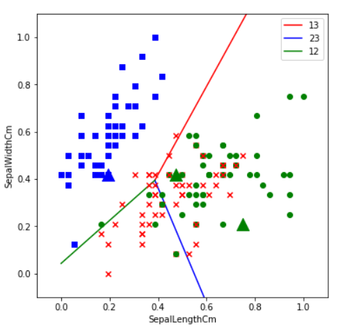

# 2019实践空间站—神经网络简明教程-入门项目

## 中期任务_Iris 
- jupyter notebook
- python3.7.3

### Problems
在对鸢尾花的数据进行处理时遇到了`几个问题`

   1. `Solved`数据的过滤,这个鸢尾花数据集有4个,这4个数据会有各自的相关性与权重,如果都用上,将无法实现可视化处理

   2. `Solved`数据的处理,最主要两个的就是将Species转换成categories的123,以及将数据转成.npz格式后正确使用DataReader类

   3. `Unsolved`Loss值的下界只有0.85左右,再往下就NAN，已经多次调整多学习率，批处理数与迭代数，尝试的结果是Loss值只能稳定下降到0.85

   4. `Unsolved`最终可视化结果时, 第二类 和 第三类 的点重叠率有点高,可能是数据集的问题,导致分类射线的效果不太好
   
   5. `Unsolved`将代码进行3个一对一二分类分类器改良时，发现代码有部分问题，有一个问题是属性项出现ERROR，正在纠错中（提交的代码里已经将该段注释掉）
 
### Visualizion Result

#### Code base on  

'https://github.com/Icepallas/ai-edu/tree/master/B-%E6%95%99%E5%AD%A6%E6%A1%88%E4%BE%8B%E4%B8%8E%E5%AE%9E%E8%B7%B5/B6-%E7%A5%9E%E7%BB%8F%E7%BD%91%E7%BB%9C%E5%9F%BA%E6%9C%AC%E5%8E%9F%E7%90%86%E7%AE%80%E6%98%8E%E6%95%99%E7%A8%8B/SourceCode/ch07-LinearMultipleClassification'

# MSRA_project_NeuralNet
since 2019
